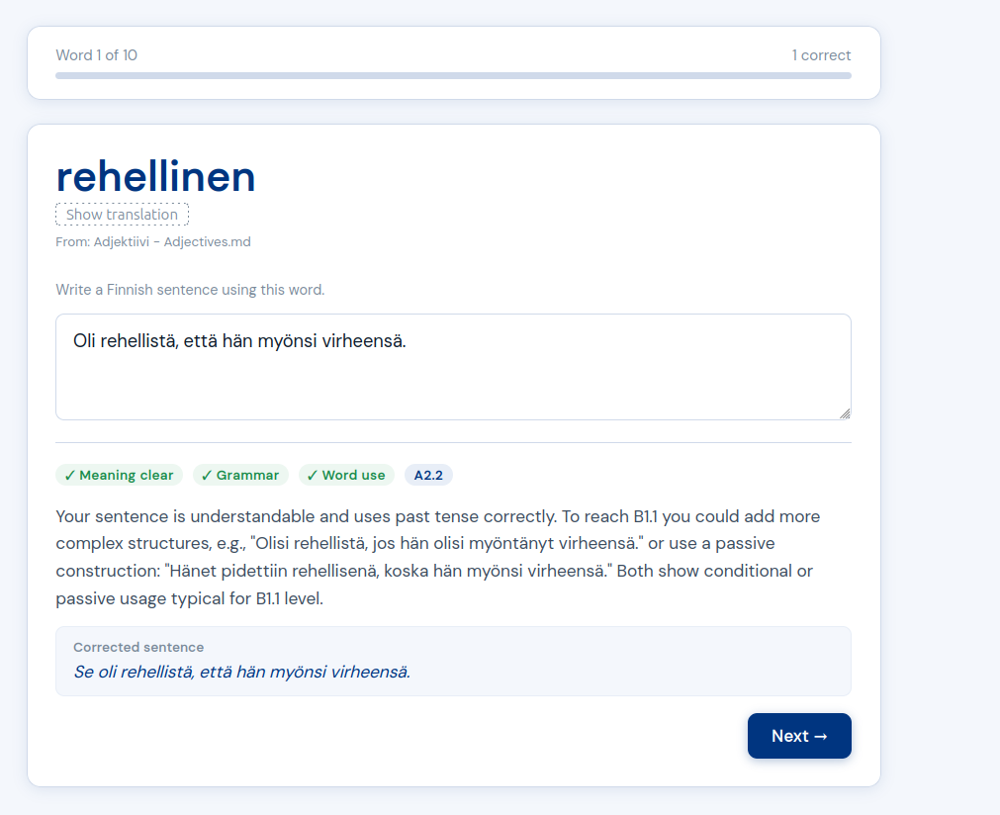
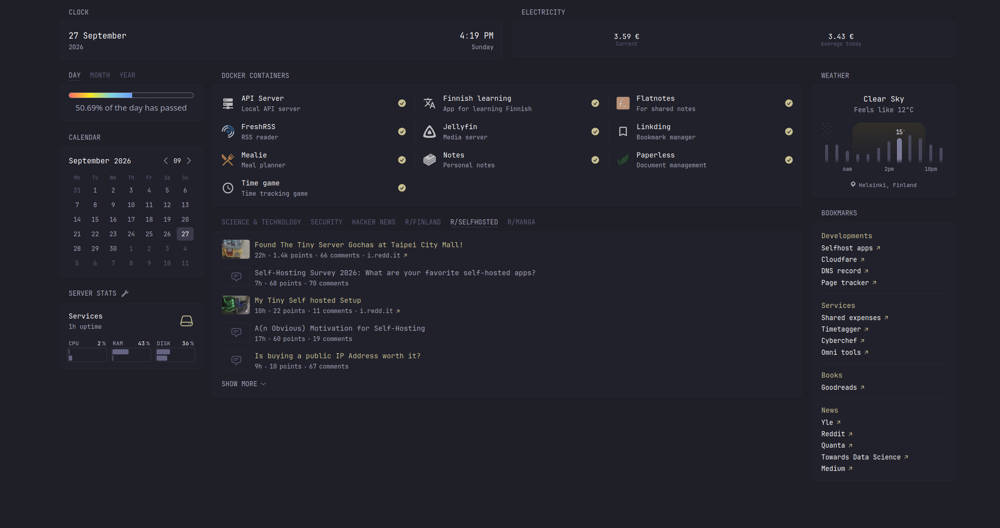

+++
date = '2026-09-27T14:19:45+03:00'
title = 'My Self Hosting Journey'
description = 'Some random thoughts about what I have done setting up my own server'
+++

About two and a half years ago, I decided to start my own local server at home. There wasn't any specific reason for it, but since I'm already working in the IT field and I happen to have a spare laptop, I thought it would make sense to at least try it. 
The setup I've had (and still have) is really simple: a laptop that runs 24/7 and an external hard drive that I have lying around. Since this server is only for personal use, I did not set up anything fancy (I did expose it to the internet via HTTPS for a while, but
I found it to be completely unnecessary and replaced it with a VPN connection). 

Throughout the years, I've added services upon services, and now the server is something that I use daily. There's nothing fancy about it (to be honest, a single old laptop isn't enough to run anything that could replace current cloud services like Google), but it has enough functionality for what I need day to day. In this post, I'll walk through what's running on my server.

# What I use my server for
Here are some services that I use my server for:
- I automatically download spot electricity prices every day and use a simple app to visualize the data. I'm on this kind of "spot electricity price" plan, which changes hourly, so I sometimes need to check prices to decide whether to do certain things. There's a website that already provides this, but I'd rather see it directly in my dashboard with all the extra fees factored in, and be able to analyze the data myself — that's why I built this setup. Here's what it looks like (UI isn't my strong suit!): 
- All the popular self-hosted services like [Home Assistant](https://www.home-assistant.io/), [Jellyfin](https://jellyfin.org/), [FreshRSS](https://freshrss.org/), [Paperless-ngx](https://docs.paperless-ngx.com/), [Mealie](https://mealie.io/). I rarely use these, but they serve their purposes from time to time.
- A place to keep my notes, diaries, drafts, etc. This is actually the most important service, and one of the first services that I set up. I use [Obsidian](https://obsidian.md/) quite extensively, since I like having a centralized place for my notes that I can access and edit from anywhere. I use [syncthing](https://syncthing.net/) to sync everything across devices. There are also several scripts running every day as cron jobs to keep my notes tidy, for example:
  - A script to automatically move all old diary notes to an `archive` folder outside of the main notes folder
  - A script to automatically parse the content I've bookmarked using the [Linkding](https://github.com/sissbruecker/linkding) app and create a note in some temp folder inside the vault so that I can read or adjust it later
  - Using [Quartz](https://quartz.jzhao.xyz/) to explore the vault content on the web
  - A script to automatically create a daily note in a certain format, with a checklist of things to do.
- Finnish learning app. I vibe-coded (with extra review and guidance) a simple app using AI to help me learn Finnish. I know AI isn't 100% accurate, especially with languages other than English, but I still find it a good way to force myself to think in Finnish, and it gives me generally good enough feedback to know what I should improve. Here's what it looks like: 
- Todo app. I've tried different apps and even built one myself, but I haven't found anything I really like, so I don't use it much.
- A dashboard to visualize all the running services and other information I find interesting. I use the [Glance](https://github.com/glanceapp/glance) app for this. Here's a quick look at my dashboard: 
- Hosted game! I used to run a Valheim server here for my friends to play together, but it's not running anymore since we finished our playthrough.
- Book management app. There are a lot of services out there ([Calibre-web](https://github.com/janeczku/calibre-web), [Grimmory](https://github.com/grimmory-tools/grimmory), [Kavita](https://www.kavitareader.com/), etc.). I've tried them all, but recently I ran into a use case none of them supported: keeping track of my physical books too. Also, since I read books in different languages (Vietnamese and English mostly, trying to read in Finnish now :D), these apps' multi-language metadata handling isn't good enough for me, which is why I've decided to build my own — using Rust, since I'm learning the language.

# Configuration
I wanted the most basic and popular tools possible, so I decided to use [Ubuntu Server](https://ubuntu.com/server) as the operating system. All web services are running inside [Docker](https://www.docker.com/) containers. I did use nginx as a reverse proxy, but since I don't really have a use for public-facing services, I removed it and now just use a simple VPN with [WireGuard](https://www.wireguard.com/) to access the services externally.

I also want to have a DNS record so that I don't need to remember and use my IP addresses everywhere. I use [Cloudflare](https://www.cloudflare.com/) as my DNS provider and bought a domain.

I rarely touch the laptop that runs the server at all, so a simple SSH connection from my main computer is enough to run the server. All configuration changes, updates, and backups happen over SSH.

To set up the services, I use Docker:
- Each service has its own folder, with its own `docker-compose.yml` file. 
- I use [Ansible](https://www.ansible.com/) to automate the deployment of these services as well as cron jobs, so that if I ever need to completely reset the server, I can just run a single command to set everything up again. 

I also have a simple script that backs up the data to my main computer, plus another that backs up to an external hard drive. I don't back up everything daily, only when I use my main computer. Lately, I have been too lazy to also run the script, run updates, and reboot the server, so I've created a Claude skill to take care of all that.

# Lessons learned
Here are some things I've picked up along the way:
- **Start simple, add more later.** A single server plus whatever you think you'll use the most is enough to get going. You can always add more down the line — and trust me, you will.
- **Cleaning up is important.** In the middle of the journey, I started hosting more and more services, many of which turned out not to be useful to me at all. I periodically go through my setup and remove the ones I don't use anymore. This keeps my server clean and easy to maintain, and it's a big part of why I have not had any trouble with it the whole time.
- **Not being public-facing is one less thing to worry about.** Dropping the reverse proxy and public HTTPS exposure in favor of a VPN made the whole setup simpler and took a constant, nagging worry off my mind. I do keep my server up-to-date and well-maintained, but having it behind a VPN means I don't have to spend a lot of time worrying about potential security issues.
- **Automate the boring, repetitive stuff.** Ansible for deployments, cron jobs for tidying notes, and now a Claude skill for updates, backups, and reboots — the less I have to remember to do manually, the more likely the server actually stays maintained.
- **Backups are important.** I have not had any incident with data loss, but as a software developer, I cannot stress this enough. If you're storing important data on your server, be sure to always have a backup somewhere.

Overall, self-hosting has been a fun journey. I'm still adding more services, tools, and scripts to it all the time. This actually creates a creative space for me to explore and learn new things. If you want to start your own self-hosting journey, here are a few resources that I found useful:
- [Self-hosting subreddit](https://www.reddit.com/r/selfhosted/)
- [List of self-hosted apps](https://selfh.st/apps/)
- A little knowledge of Docker, networking, and nginx would help — there are plenty of tutorials online for these topics.
- Some scripting knowledge (Bash, Python, etc.) would help with automating things.